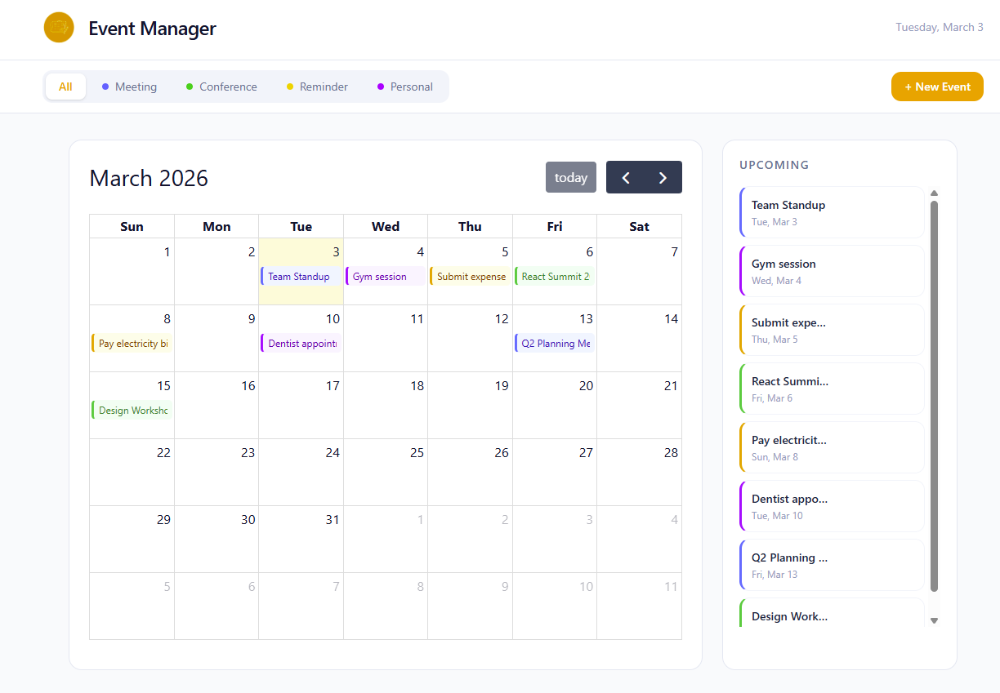
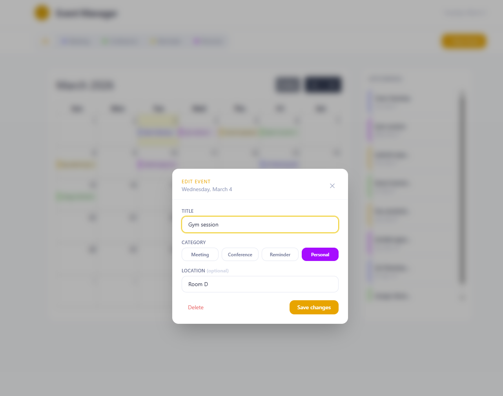

# 📅 Event Manager

A clean, elegant event management app built with React, TypeScript, and Tailwind CSS. Designed for managing and visualising events with a polished, productivity-focused UI.

---

## 📸 Screenshots

> **Dashboard**
> 

> **New Event Modal**
> 

---

## 🔗 Live Demo

[→ View Live](https://your-live-link-here.com)

---

## ✨ Features

- 📆 Full monthly calendar view powered by FullCalendar
- 🏷️ Four event categories — Meeting, Conference, Reminder, Personal
- 🎨 Color-coded events with left-border accent style
- 🔍 Toolbar category filter with instant updates
- ➕ Add events via toolbar or by clicking any calendar date
- ✏️ Edit and delete events inline
- 📋 Upcoming events sidebar with hover actions
- 💅 Fully responsive, light-mode UI

---

## 🛠️ Tech Stack

- [React 18](https://react.dev)
- [TypeScript](https://www.typescriptlang.org)
- [Vite](https://vitejs.dev)
- [Tailwind CSS](https://tailwindcss.com)
- [FullCalendar](https://fullcalendar.io)

---

## ⚖️ License

Copyright © 2026. All rights reserved. This project is proprietary — see [`LICENSE`](./LICENSE) for full terms.